# Wine market analysis based on WIWINO

## Overview

The wiwino database is a comprehensive collection of wine-related data scraped from the WIWINO application. This repository includes an analysis of the scraped data, which has been sorted into a structured database format for easy access and analysis. The database contains information on various aspects of wine, including details about wines, wineries, reviews, vintages, regions, countries, toplists, vintage toplist rankings, keywords, grapes, and more. Insights have been derived from the data to facilitate research, exploration, and understanding of the wine industry.

## Contents

1. **Database Structure**: The database consists of the following tables:

- `vintages`: Information about different vintages of wines, including name, ratings, production year, price and volume. 
- `wines`: Details about various wines including name, ratings, page url,  and certain structural qualities such as acidity, fizziness etc.
- `regions`: Details about wine-producing regions.
- `countries`: Information about countries related to wines.
- `toplists`: Toplists of the different countries.
- `vintage_toplist_rankings`: Rankings of wines or wineries within specific toplists.
- `keywords_wine`: Keywords associated with taste types of wines.
- `keywords`: Keywords related to subtastes of wine.
- `grapes`: Information about grape varieties.
- `most_used_grapes_per_country`: Most used grape varieties per country.
- `wineries`: Information about wineries.

Below is the schema for the database: 

2. **Database analysis**

 - `exp_data.ipynb` includes queries and plots that was made during the exploratory analysis of the database
 - `main_insights.ipynb` has a collection of valuable insights that were made during the exploration

## Insights

The main insights are collected below. 

### Q1: The top 10 wines to recommend.

Evaluating several interesting product qualities, the following table of top 10 recommendations were established. 

The selection includes the most expensive, the oldest, youngest, the highest ranked, sweetest, most intense, the biggest bottle, the mostly rated, the fizziest, and the wine that has the most tannin. 

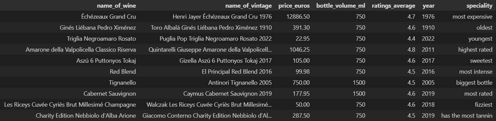

### Q2: Which country to prioritize?

The United States has the highest number of users and the third highest number of wines, resulting in the highest users/wines ratio. It also has a relatively high average rating of wines. Thus, the United States should be the country to prioritize. 

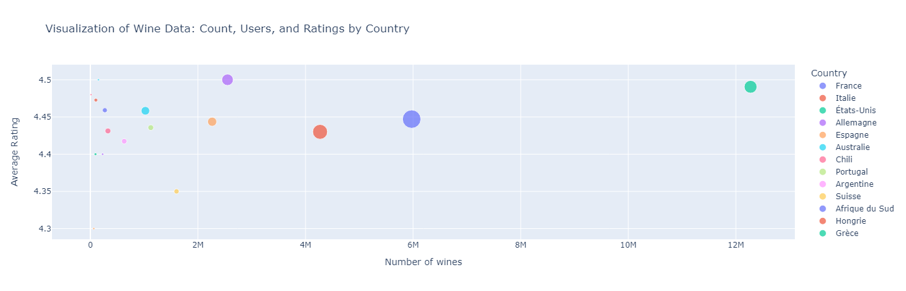

### Q3: Investingatint wines with tastes: coffee, toast, green apple, cream and citrus

There are 19 wines that have this specific taste combination. These wines are displayed ordered by their average rating in the below table.

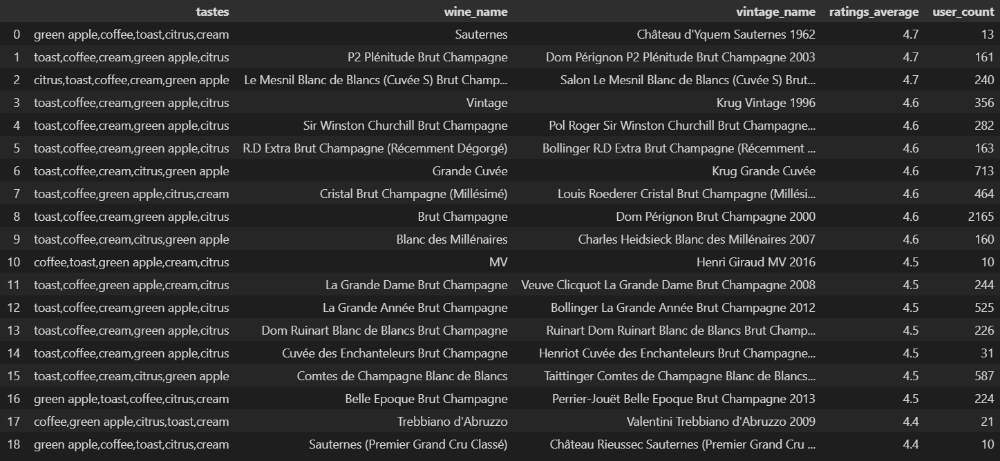

### Q4: The most used grapes and the top 5 wines based on their ratings from each grape

The top 3 grapes according to the database are displayed below:

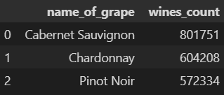

The top 5 wines made of *Cabernet Sauvignon*:

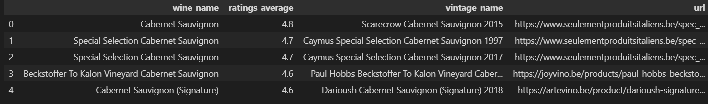

The top 5 wines made of *Chardonnay*:

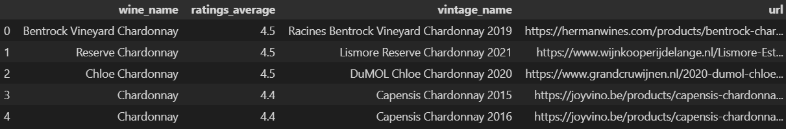

The top 5 wines made of *Pinot Noir*:

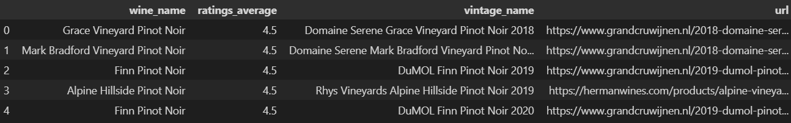

### Q5: The country leaderboard

The average wine rating across countries:

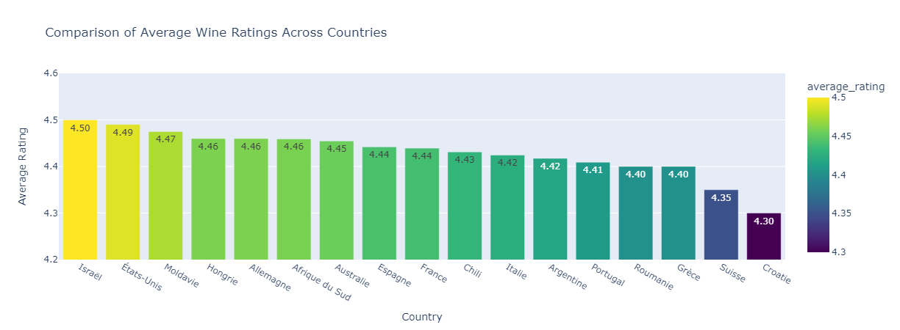

The average vintage rating across countries:

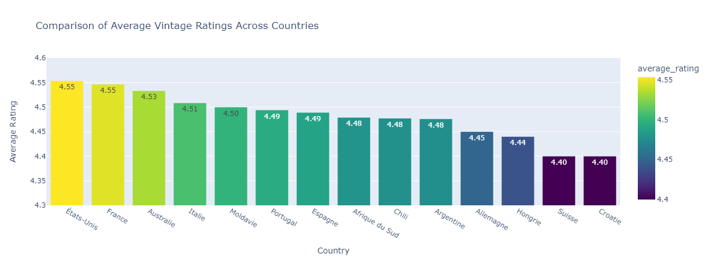

### Q6: Top 5 Cabernet Savignon choices

### Tastes of Hungary and the biggest wine producers

This pie chart below shows the typical tastes of Hungarian wines.

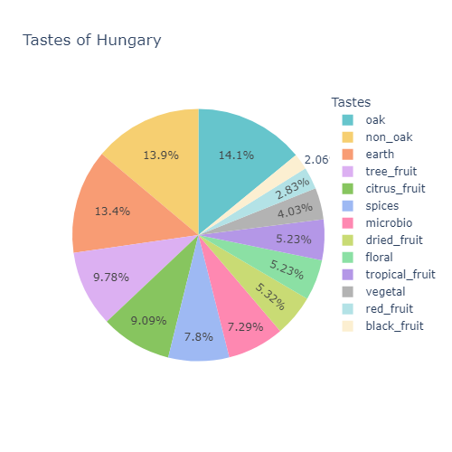

Additionally, there are similar charts of the 3 biggest wine producers across the countries.

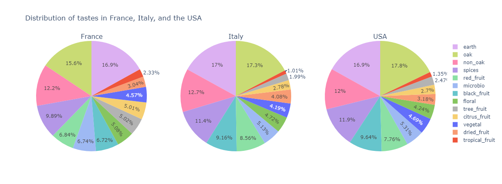

Below, there is an overview of all the countries and their wine properties: fizziness, sweetness and acidity.
The bubble sizes correspond to the sweetness of the wines. 

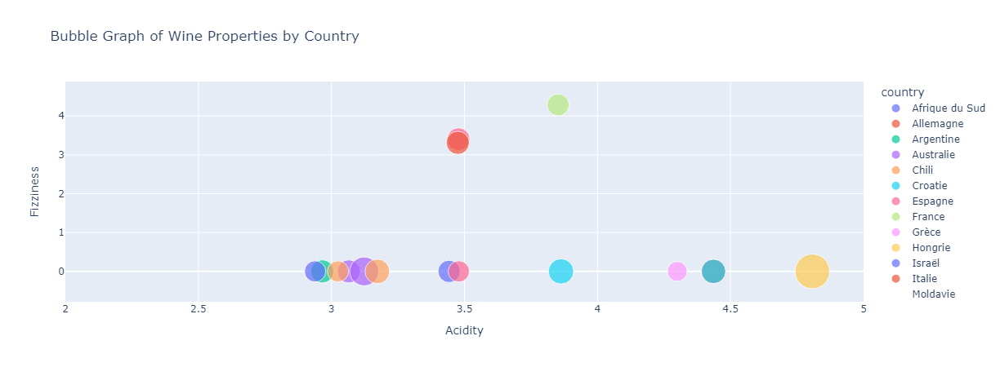

